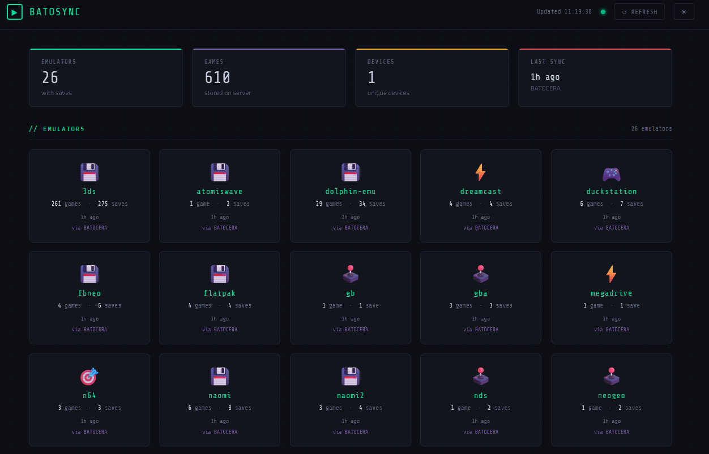

# BatoSync 🎮

Keep your save files in sync across multiple Batocera devices automatically.



BatoSync runs as a small Docker container on any machine in your home network (a NAS, an old PC, a Raspberry Pi, etc.). Each Batocera device runs a single script to push its saves up and pull down the latest version before you play.

---

## How it works

```
┌──────────────┐     push/pull     ┌─────────────────────┐     push/pull     ┌──────────────┐
│  Batocera    │ ◄───────────────► │  BatoSync Server   │ ◄───────────────► │  Batocera    │
│  (Device 1)  │                   │  (Docker container) │                   │  (Device 2)  │
└──────────────┘                   │                     │                   └──────────────┘
                                   │  • Stores up to 3   │
                                   │    backups per game  │
                                   │  • Tracks which      │
                                   │    device saved last │
                                   │  • MD5 checksums     │
                                   └─────────────────────┘
```

The server keeps the **3 most recent saves** for each game and knows which device saved last. When you run the sync script on a Batocera device it:

1. **Pushes** any saves that are newer than what the server has
2. **Pulls** any saves that the server has which are newer than your local copy

---

## Part 1 — Setting up the Server

You need a machine running **Docker** that stays on (or is on when you want to sync). This could be a NAS, a Raspberry Pi, a desktop, or any always-on PC.

### Step 1 — Copy the server files

Copy the `batosync/` folder to your server machine. You only need:
- `docker-compose.yml`
- `server/Dockerfile`
- `server/app.py`
- `server/requirements.txt`

### Step 2 — Set your API key

Open `docker-compose.yml` and change the `API_KEY` value:

```yaml
environment:
  - API_KEY=change_me_to_a_secret_passphrase   # ← change this
  - MAX_BACKUPS=20               # keep last 20 saves per game
```

Pick any passphrase. Write it down — you'll need it on each Batocera device.

### Step 3 — Start the server

```bash
cd batosync
docker compose up -d
```

Check it's running:
```bash
curl http://localhost:5000/health
# Should return: {"status": "ok", "service": "BatoSync"}
```

### Step 4 — Find your server's IP address

```bash
hostname -I
```

Note the IP (e.g. `192.168.1.100`). Your Batocera devices will connect to this address.

---

## Part 2 — Setting up each Batocera Device

Do these steps on **every** Batocera device you want to sync.

### Step 1 — Copy the client files

Connect to your Batocera device over SSH or via the file manager and copy these files:

```bash
# Main sync script and config
scp client/batosync.sh   root@192.168.1.50:/userdata/scripts/
scp client/batosync.conf root@192.168.1.50:/userdata/system/

# Game event hooks — must go in /userdata/system/scripts/ (not /userdata/scripts/)
ssh root@192.168.1.50 "mkdir -p /userdata/system/scripts"
scp client/gameStart.sh  root@192.168.1.50:/userdata/system/scripts/
scp client/gameStop.sh   root@192.168.1.50:/userdata/system/scripts/

# Boot sync (optional)
scp client/autostart.sh  root@192.168.1.50:/userdata/system/autostart.sh
```

The default SSH password for Batocera is `linux`.

### Step 2 — Edit the configuration file

SSH into the device and edit the config:
```bash
ssh root@192.168.1.50
nano /userdata/system/batosync.conf
```

Change these three values:

```bash
export BATOSYNC_SERVER="http://192.168.1.100:5000"   # your server's IP
export BATOSYNC_KEY="change_me_to_a_secret_passphrase"             # matches docker-compose.yml
export BATOSYNC_DEVICE="living-room-pi"              # a friendly name for THIS device
```

### Step 3 — Make the scripts executable

```bash
ssh root@192.168.1.50 "chmod +x /userdata/scripts/batosync.sh /userdata/system/scripts/gameStart.sh /userdata/system/scripts/gameStop.sh /userdata/system/autostart.sh"
```

### Step 4 — Test it

```bash
/userdata/scripts/batosync.sh --list
```

This should show an empty game list (since nothing has synced yet). If it works, try a full sync:

```bash
/userdata/scripts/batosync.sh
```

---

## Part 3 — Setting up a MuOS Device (e.g. Anbernic RG40XXV)

MuOS is supported. You need SSH access — enable it first under **Configuration → Web Services → SFTP + Filebrowser → Enabled**.

- **SSH user:** `muos` &nbsp; **Password:** `muos` &nbsp; **Port:** `2022`

### Step 1 — Create directories

```bash
ssh -p 2022 muos@<device-ip>
mkdir -p /mnt/mmc/MUOS/bin /mnt/mmc/MUOS/log
```

### Step 2 — Copy the client files

```bash
scp -P 2022 client/batosync.sh muos@<device-ip>:/mnt/mmc/MUOS/bin/batosync.sh
```

### Step 3 — Create the configuration file

SSH in and create the config:

```bash
cat > /mnt/mmc/MUOS/batosync.conf << 'EOF'
export BATOSYNC_SERVER="http://192.168.1.100:5000"
export BATOSYNC_KEY="change_me_to_a_secret_passphrase"
export BATOSYNC_DEVICE="my-rg40xxv"
export BATOSYNC_SAVES="/mnt/mmc/MUOS/save"
export BATOSYNC_LOG="/mnt/mmc/MUOS/log/batosync.log"
EOF
```

### Step 4 — Make the script executable

```bash
chmod +x /mnt/mmc/MUOS/bin/batosync.sh
```

### Step 5 — Test the sync script

```bash
/mnt/mmc/MUOS/bin/batosync.sh --list
```

If that shows your games, run a full sync:

```bash
/mnt/mmc/MUOS/bin/batosync.sh --pull
```

### Step 6 — Wire up automatic sync on game launch/quit

MuOS runs all content through `/opt/muos/script/mux/launch.sh`. It already has `LAUNCH_PREP` and `LAUNCH_DONE` hook points but they're set per-system via INI files. The cleanest way to inject BatoSync without editing dozens of INI files is to add two lines to `launch.sh` that call user hook scripts from the SD card if they exist.

**6a — Patch launch.sh** (one-time edit, ~30 seconds):

```bash
ssh -p 2022 muos@<device-ip>
```

Open the file:
```bash
vi /opt/muos/script/mux/launch.sh
```

Find this block (it's near the bottom of the `else` branch):
```sh
        [ -n "$LAUNCH_PREP" ] && "$LAUNCH_PREP" "$NAME" "$CORE" "$ROM"

        [ "${USE_ACTIVITY:-0}" -eq 1 ] && /opt/muos/script/mux/track.sh "$NAME" "$CORE" "$ROM" start
        "$LAUNCH_EXEC" "$NAME" "$CORE" "$ROM"
        [ "${USE_ACTIVITY:-0}" -eq 1 ] && /opt/muos/script/mux/track.sh "$NAME" "$CORE" "$ROM" stop

        [ -n "$LAUNCH_DONE" ] && "$LAUNCH_DONE" "$NAME" "$CORE" "$ROM"
```

Add the two BatoSync lines (marked with `# ← add`):
```sh
        [ -n "$LAUNCH_PREP" ] && "$LAUNCH_PREP" "$NAME" "$CORE" "$ROM"
        [ -x "/mnt/mmc/MUOS/hook/content-load.sh" ] && /mnt/mmc/MUOS/hook/content-load.sh "$NAME" "$CORE" "$ROM"  # ← add

        [ "${USE_ACTIVITY:-0}" -eq 1 ] && /opt/muos/script/mux/track.sh "$NAME" "$CORE" "$ROM" start
        "$LAUNCH_EXEC" "$NAME" "$CORE" "$ROM"
        [ "${USE_ACTIVITY:-0}" -eq 1 ] && /opt/muos/script/mux/track.sh "$NAME" "$CORE" "$ROM" stop

        [ -n "$LAUNCH_DONE" ] && "$LAUNCH_DONE" "$NAME" "$CORE" "$ROM"
        [ -x "/mnt/mmc/MUOS/hook/content-quit.sh" ] && /mnt/mmc/MUOS/hook/content-quit.sh "$NAME" "$CORE" "$ROM"  # ← add
```

> **After a MuOS firmware update** this file may be restored to its original. Just re-add these two lines. Everything else (your hook scripts, config, saves) is on the SD card and unaffected.

**6b — Install the hook scripts:**

```bash
ssh -p 2022 muos@<device-ip> "mkdir -p /mnt/mmc/MUOS/hook"
scp -P 2022 client/muos-content-load.sh muos@<device-ip>:/mnt/mmc/MUOS/hook/content-load.sh
scp -P 2022 client/muos-content-quit.sh muos@<device-ip>:/mnt/mmc/MUOS/hook/content-quit.sh
ssh -p 2022 muos@<device-ip> "chmod +x /mnt/mmc/MUOS/hook/content-load.sh /mnt/mmc/MUOS/hook/content-quit.sh"
```

What each script does:

- **content-load.sh** — runs just before the emulator launches. Pulls the save for that specific game so you always start with the latest progress.
- **content-quit.sh** — runs after the emulator exits. Waits 3 seconds for filesystem flush, then pushes your save up to the server.

Both scripts extract the system name from the ROM's parent directory (e.g. `/mnt/mmc/roms/SNES/` → `snes`, lowercased) and the game name from the filename — matching the same key convention BatoSync uses on Batocera so saves stay in sync across both platforms.

### Step 7 — Install the boot sync (optional)

To pull all saves when the device powers on:

```bash
ssh -p 2022 muos@<device-ip> "mkdir -p /mnt/mmc/MUOS/init"
scp -P 2022 client/muos-init.sh muos@<device-ip>:/mnt/mmc/MUOS/init/batosync.sh
ssh -p 2022 muos@<device-ip> "chmod +x /mnt/mmc/MUOS/init/batosync.sh"
```

MuOS runs all scripts in `/mnt/mmc/MUOS/init/` automatically at boot. This waits for the network (up to 30 seconds) then pulls all saves in the background while the UI loads.

### Step 8 — Test the hooks

Test the quit hook manually with a fake ROM path:

```bash
ssh -p 2022 muos@<device-ip>
sh /mnt/mmc/MUOS/hook/content-quit.sh "Super Mario World" "lr-snes9x" "/mnt/mmc/roms/SNES/Super Mario World.sfc"
cat /mnt/mmc/MUOS/log/batosync.log
```

You should see a `[GAME STOP]` entry and a successful push in the log.

> **MuOS save locations** — saves are stored under `/mnt/mmc/MUOS/save/` organised by emulator:
> - Save states: `/mnt/mmc/MUOS/save/state/<emulator>/`
> - Memory cards: `/mnt/mmc/MUOS/save/file/<emulator>/`
> - PSP saves: `/mnt/mmc/MUOS/save/psp/PSP/SAVEDATA/`

---

## Adding a new device

When setting up BatoSync on a device for the first time, always **pull before you play**. This downloads all existing saves from the server so the device starts fully in sync:

```bash
/userdata/scripts/batosync.sh --pull
```

After that first pull, just play normally — saves will push to the server when you quit a game and pull down any new games you've never played on this device.

> **Why this matters:** BatoSync never overwrites an existing local save on pull — it only downloads saves for games not yet present on that device. If you skip the first pull and play a game before syncing, that device's save becomes the authoritative version for that game and will push to the server, potentially replacing progress from another device.

---

## Using BatoSync

### Basic commands

```bash
# Sync everything (push local → server, then pull server → local)
/userdata/scripts/batosync.sh

# Push only (upload your saves to the server)
/userdata/scripts/batosync.sh --push

# Pull only (download latest saves from server)
/userdata/scripts/batosync.sh --pull

# List all games stored on the server
/userdata/scripts/batosync.sh --list

# Show sync status without changing anything
/userdata/scripts/batosync.sh --status

# Sync a specific game only
/userdata/scripts/batosync.sh --game "Super Mario"
```

### Automatic sync on game launch/close (Batocera)

Batocera automatically calls all scripts in `/userdata/system/scripts/` on every game event — no extra configuration needed.

```bash
# Create the scripts directory if it doesn't exist
ssh root@192.168.1.50 "mkdir -p /userdata/system/scripts"

# Copy auto-sync scripts
scp client/gameStart.sh root@192.168.1.50:/userdata/system/scripts/
scp client/gameStop.sh  root@192.168.1.50:/userdata/system/scripts/

# Make them executable
ssh root@192.168.1.50 "chmod +x /userdata/system/scripts/gameStart.sh /userdata/system/scripts/gameStop.sh"
```

> **Important:** these scripts must go in `/userdata/system/scripts/`, not `/userdata/scripts/`. Batocera's EmulationStation only watches the `system/scripts/` directory for game events.

What each script does:

- **gameStart.sh** — Batocera calls this just before launching a game. It pulls the latest save for that specific game from the server so you always start with the most recent progress.
- **gameStop.sh** — Batocera calls this when you quit a game. It waits 3 seconds (so the emulator finishes writing), then pushes your fresh save up to the server.

### Automatic sync on boot

To pull all saves when the device powers on, copy the autostart script:

```bash
scp client/autostart.sh root@192.168.1.50:/userdata/system/autostart.sh
ssh root@192.168.1.50 "chmod +x /userdata/system/autostart.sh"
```

This waits for the network to be ready (up to 30 seconds) and then pulls all saves in the background while EmulationStation is loading, so there's no delay on startup.

> **If you already have a custom autostart.sh**, don't replace it — open both files and paste the BatoSync section into your existing one.

---

## Web Dashboard

Open `http://<your-server-ip>:5000` in any browser on your home network to see the dashboard. It shows:

- All games with saves stored on the server
- Which device saved each game last, and when
- All backup slots per game (click a row to expand)
- Download buttons for any save or backup
- Live device list showing which machines have synced

The dashboard auto-refreshes every 30 seconds.

---

## Checking saves via API

You can also query the server directly:

```bash
SERVER="http://192.168.1.100:5000"
KEY="change_me_to_a_secret_passphrase"

# List all games
curl -H "X-API-Key: $KEY" $SERVER/games

# Show backups for a specific game
curl -H "X-API-Key: $KEY" "$SERVER/saves/snes_Super%20Mario%20World"

# Download the latest save manually
curl -H "X-API-Key: $KEY" \
     "$SERVER/saves/snes_Super%20Mario%20World/latest" \
     -o mario_world.srm

# Download a specific backup (0=latest, 1=previous, 2=oldest)
curl -H "X-API-Key: $KEY" \
     "$SERVER/saves/snes_Super%20Mario%20World/1" \
     -o mario_world_backup.srm
```

---

## Viewing logs

Logs are written on each Batocera device at:
```
/userdata/system/logs/batosync.log
```

---

## Troubleshooting

| Problem | Solution |
|---|---|
| "Cannot reach server" | Check the server IP, confirm Docker is running, check firewall isn't blocking port 5000 |
| "Unauthorized" | The `API_KEY` in `batosync.conf` doesn't match `docker-compose.yml` |
| Saves not appearing | Check `/userdata/saves/` contains `.srm`, `.sav`, or `.state` files |
| Duplicate syncs | Normal — the script detects identical checksums and skips them |
| Want more/fewer backups | Change `MAX_BACKUPS=20` in `docker-compose.yml` and restart |
| gameStart/gameStop not triggering | Scripts must be in `/userdata/system/scripts/`, not `/userdata/scripts/` |
| MuOS hooks not triggering | Check the two lines were added to `/opt/muos/script/mux/launch.sh` (a firmware update may have restored it); confirm `/mnt/mmc/MUOS/hook/content-load.sh` and `content-quit.sh` are executable |
| MuOS: `#!/bin/bash: not found` or `syntax error: unexpected redirection` | CRLF line endings in a script copied from Windows — run `sed -i 's/\r$//' /mnt/mmc/MUOS/bin/batosync.sh` (and the hook scripts) |
| MuOS: `#: not found` when sourcing config | UTF-8 BOM in `batosync.conf` — run `sed -i '1s/^\xEF\xBB\xBF//' /mnt/mmc/MUOS/batosync.conf` |
| Scripts fail with `[[: not found` | Run with `bash script.sh`, not `sh script.sh` — or check for Windows line endings (CRLF) with `file script.sh` and fix with `dos2unix script.sh` |
| Config file causes `#: command not found` | BOM in config file — fix with `sed -i '1s/^\xEF\xBB\xBF//' /userdata/system/batosync.conf` |

---

## File structure

```
batosync/
├── docker-compose.yml             ← start here for the server
├── server/
│   ├── Dockerfile
│   ├── app.py                     ← Flask API + dashboard server
│   ├── requirements.txt
│   └── templates/
│       └── dashboard.html         ← web dashboard (served at :5000/)
└── client/
    ├── batosync.sh                ← main sync script (copy to each device)
    ├── batosync.conf              ← configuration template
    ├── gameStart.sh               ← Batocera: auto-pull on game launch
    ├── gameStop.sh                ← Batocera: auto-push on game quit
    ├── autostart.sh               ← Batocera: pull all saves at boot
    ├── muos-content-load.sh       ← MuOS: auto-pull on game launch
    ├── muos-content-quit.sh       ← MuOS: auto-push on game quit
    └── muos-init.sh               ← MuOS: pull all saves at boot
```

Save data on the server is stored in a Docker named volume (`batosync_data`) so it persists across container restarts and updates.

---

## Cheat Sheet

### Make all scripts executable (one line)
```bash
chmod +x /userdata/scripts/batosync.sh /userdata/system/scripts/gameStart.sh /userdata/system/scripts/gameStop.sh /userdata/system/autostart.sh
```

### Fix BOM / Windows line endings on all files (one line)
```bash
for f in /userdata/scripts/batosync.sh /userdata/system/scripts/gameStart.sh /userdata/system/scripts/gameStop.sh /userdata/system/autostart.sh /userdata/system/batosync.conf; do sed -i '1s/^\xEF\xBB\xBF//' "$f"; done
```

### File locations — Batocera
| File | Location |
|---|---|
| `batosync.sh` | `/userdata/scripts/batosync.sh` |
| `batosync.conf` | `/userdata/system/batosync.conf` |
| `gameStart.sh` | `/userdata/system/scripts/gameStart.sh` |
| `gameStop.sh` | `/userdata/system/scripts/gameStop.sh` |
| `autostart.sh` | `/userdata/system/autostart.sh` |
| Log file | `/userdata/system/logs/batosync.log` |

### File locations — MuOS
| File | Location |
|---|---|
| `batosync.sh` | `/mnt/mmc/MUOS/bin/batosync.sh` |
| `batosync.conf` | `/mnt/mmc/MUOS/batosync.conf` |
| `muos-content-load.sh` | `/mnt/mmc/MUOS/hook/content-load.sh` |
| `muos-content-quit.sh` | `/mnt/mmc/MUOS/hook/content-quit.sh` |
| `muos-init.sh` | `/mnt/mmc/MUOS/init/batosync.sh` |
| Log file | `/mnt/mmc/MUOS/log/batosync.log` |

### Useful commands — Batocera
```bash
# View the log
cat /userdata/system/logs/batosync.log

# Test connection and list games on server
/userdata/scripts/batosync.sh --list

# Manual full sync
/userdata/scripts/batosync.sh

# Test game stop hook manually
bash /userdata/system/scripts/gameStop.sh gameStop snes libretro snes9x "/userdata/roms/snes/mygame.sfc"
```

### Fix CRLF line endings — MuOS (run on device after copying files from Windows)
```bash
for f in /mnt/mmc/MUOS/bin/batosync.sh \
          /mnt/mmc/MUOS/hook/content-load.sh \
          /mnt/mmc/MUOS/hook/content-quit.sh \
          /mnt/mmc/MUOS/init/batosync.sh \
          /mnt/mmc/MUOS/batosync.conf; do
    sed -i 's/\r$//' "$f"
done
# Also strip BOM from config if present
sed -i '1s/^\xEF\xBB\xBF//' /mnt/mmc/MUOS/batosync.conf
```

### Useful commands — MuOS
```bash
# View the log
cat /mnt/mmc/MUOS/log/batosync.log

# Test connection and list games on server
/mnt/mmc/MUOS/bin/batosync.sh --list

# Manual full sync
/mnt/mmc/MUOS/bin/batosync.sh

# Find hook directory on device
find /opt/muos -name "*.sh" 2>/dev/null | grep -iE "launch|quit|load|content|event"

# Test quit hook manually
sh /mnt/mmc/MUOS/hook/content-quit.sh "My Game" "lr-snes9x" "/mnt/mmc/roms/SNES/My Game.sfc"
```
